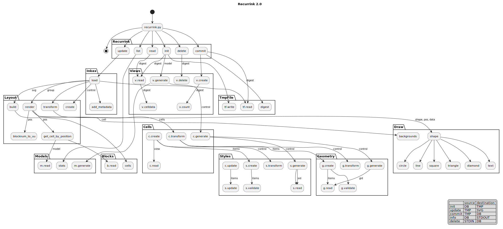

# Recurrink
A Python program based on Inkscape. Recurrink is used to create these [recurring patterns](https://www.instagram.com/recurrink/) that you can see on Instagram.

## An Introduction to Recurrink
Rather than call them patterns, we shall call them **rinks**. Blocks, Cells and Models make a rink.


- A model is a template made from repeating blocks
- A block is a collection of cells, marked by the red box above
- A cell is the smallest unit as shown in blue

An example rink is shown below.


_source file [soleares.svg](./samples/soleares.svg)_

Seen another way, a rink is a vector graphic with embedded style sheets.

### Installation notes
Recurrink has been tested on Ubuntu and Mac. These notes are for a Mac :computer:.

- Apple M1 Pro
- Ventura 13.4.1

Pre-requisite casks

- brew install pygobject3 
- brew install cairo
- brew install pkg-config

The cairo and pkg-config casks are only needed because Instagram does not accept SVG :disappointed:

Python wrappers

- pip3 install pycairo
- pip3 install inkex

Installing Inkscape is not necessary. The Python modules used by Recurrink are for Inkscape Extension developement and run independently of the GUI.

#### Postgres
Postgres was also installed with homebrew and created as follows.
```
$ createdb -U ${USER} recurrink
$ psql -d recurrink
```
On linux it was a bit different.
```
sudo -i -u postgres                # only needed once
postgres@host:$ psql -d recurrink  # connects as logged in user
```
Once postgres is installed and this repo has been cloned then `cd sql` and start postgres. Then setup the database as follows.
```
recurrink=# \i ddl.sql  # create tables required by recurrink
recurrink=# \i dml.sql  # add two models 
```

Now your local machine should be able to run Recurrink and make rinks :thumbsup:

#### Further help
- [Read about Inkscape Extensions](https://inkscape.org/gallery/=extension/) and visit the gallery.
- [Tutorial on Inkscape Extensions](https://inkscapetutorial.org/pages/extension.html)
- [Inkscape reference documentation](https://inkscape.gitlab.io/inkscape/doxygen-extensions/index.html)
- [Post on the Inkscape Extension Forum](https://inkscape.org/forums/extensions/)

## User Manual
This section is aimed at those wanting to build rinks. Following sections will cover software development. The lifecycle of a rink has three main phases

- Initialise
- Update
- Commit

The objects that change state during the cycle are:

- `Config` a temporary text file that holds the attributes of each cell.
- `SVG` the image built from the config by Inkscape.
- `Database` permenant record that makeup a library of all rinks made by one user.

This table shows at what phase an object will change during the cycle.

| |Config|SVG|Database|
|---:|:---:|---|---|
|Init|Write|-|-|
|Update|Read|Write|-|
|Commit|Read|-|Write|

Before initialisation all objects are empty. After initialisation the Config is ready. Where the config data is sourced from depends on which of the following options are given at build time.

1. No arguments (default)
1. Model
1. View  

The first option randomly generates a model name and randomly creates attributes for each cell.
The second option also randomly generates values for cells. But for the model that was defined.
The third option populates the Config by cloning from the database, using the view reference as an index.

Between Initialisation and Update is when editing of the Config takes place. This is where the artistry happens :artist: as the cell attibutes define the appearance of the rink. For example, to convert all shapes to square open the config in your favorite text editor.

```
$ vi /tmp/soleares.txt

cell shape   size    facing  top     fill    bg   fo  stroke  sw sd so
b    square  small   all     False   #FFF    #FFF 1.0 #000    1  0  1.0
a    square  medium  all     False   #FFA500 #FFF 0.5 #FFA500 6  0  0.3
c    square  medium  all     False   #FFF    #000 1.0 #000    0  0  1.0
d    circle  small   all     True    #FFA500 #FFF 1.0 #FFA500 9  1  1.0
```
Navigate to cell **d** on the fifth line and replace `circle` with `square`. Save exit and run an update. Then open `/tmp/soleares.svg` and expect to see only squares.

This process repeats until commit time. :point_down: At the commit phase, cell attributes are written to the database and become the Primary, Immutable source. Although no further editing is possible, rinks can be cloned from the database (unless they are deleted).

### Using the CLI
Making a rink is done at the command-line. Use the help to get a list of options
```
$ ./recurrink.py -h
usage: recurrink [-h] {list,read,init,commit,delete,update} ...

positional arguments:
  {list,read,init,commit,delete,update}
                        sub-command help
    list                list models in db
    read                get view metadata
    init                set config for new image
    commit              write immutable entry to db
    update              update svg from config

optional arguments:
  -h, --help            show this help message and exit
```
The three main doing commands are Init, Update and Commit. You can also drill down and get more detail on the sub-commands.

```
$ ./recurrink.py read --help
usage: recurrink read [-h] [-m MODEL] [-v VIEW]

options:
  -h, --help              show this help message and exit
  -m MODEL, --model MODEL name of base model
  -v VIEW, --view VIEW    hex name with 32 char
```
List is a good place to start because it shows the models that are available in the database. Most commands need you to supply a model name. For example,`init -m soleares` will create the Config file in `/tmp` that is shown above.

The command `read -v c152bcd1dee8915e90dfe28c05bf3774` is only used to provide the publisher with metadata. And `delete` is for clearing up any mess :shit:
But when `read` is combined with MODEL it displays how cells are organised in a block. 
#### Displaying blocks in Recurrink
The positon for each cell in the block is shown by the `read` sub-command.
```
a b a
c d c
```
_source file [soleares.csv](models/soleares.csv)_

:bulb: Knowing how cells are laid out in the block is the secret ingridient of good pattern design.

##### Labels
Another technique for locating cells in the block is labelling. Cells are named a-z. Referring to them as A-Z will cause Recurrink to print a label instead of rendering an SVG object. Try to capitalise a cell in the configuration file and then run an update and check the SVG output.

### Scaling and Control
Scale and control are applied during the **Update** phase. The control is passed in via the CLI as a two digit code. The first digit defines the scale and the second the control.

- Scale  
To zoom out use an odd number [1-9] and an even number [2-8] to zoom in. A zero or no arguments keeps the aspect at 1:1.

- Control  
Styles and Geometries can be transformed using the control parameter. For example, `update --control 01` replaces all shapes with square and removes all the strokes are removed. The default _zero_ control means that no transformations are done and the Config is written to the SVG unchanged.

### How publisher works
Rinks are published to Instagram using another program. As the publisher program is not (yet) in the public domain, we just describe the high-level flow:

- read symlinks from the `pubq/` folder and selected the oldest by default
- run cairo to generate a PNG from the SVG by following the symlink to `rinks/MODEL/VIEW.svg`
- run LFTP to transfer the PNG to a public endpoint, in this case [recurringart.com](https://recurringart.com)
- post the location to the Facebook graphQL service as explained on [post to page](https://levelup.gitconnected.com/automating-instagram-posts-with-python-and-instagram-graph-api-374f084b9f2b).

The PNGs are formatted according to the recommended specification by [Instagram](https://help.instagram.com/1631821640426723)  
* 1080 x 1080 pixels at 1:1 aspect ratio (square)

## Developer notes
This section is aimed at anyone wanting to extend the Python program.
### Database overview
At the root of the data hierarchy is a `model`. A model is the base template that defines how the rink repeats itself. Most models have musical names.
```
├── afroclave
├── arpeggio
├── soleares *
...
├── koto *
└── bossa

* included in sql/
```
The database has the following tables.

| Table | Description |
| ---   | --- |
| models           | Base template |
| blocks           | Cell co-ordinates for each model |
| views            | Instance of a model |
| cells            | Combine geometries and styles to form a cell |
| geometry         | Defines a linear shape |
| styles           | CSS attributes to style a shape |

Creating a new model cannot be done through the CLI. You will need to write SQL statements to create new table entries. There are some examples in `sql` directory. The tables that are written to by Recurrink are: views, cells, geometry and styles.

Each cell is formed from shape and style definitions. These definitions are not pre-computed, but generated on-demand.

## Software design
The software is designed around the data model as shown in the class diagram.



source: [classv2.svg](./tutorial/classv2.svg)

Classes are named after the following convention.

| | |
| --- | --- |
|*create* |INSERTS given items  |
|*read* |query logic to apply given filters  |
|*validate* |checks inputs before create or update  |
|*generate* |makes a new set of cells with some randomness  |
|*transform* |applies changes to input data based on control  |
|*delete* |has a given ID and removes rows  |

Instead of CRUD think CRVGTD :stuck_out_tongue_closed_eyes:

### Data access pattern
- Cells and views can be CREATED or DELETED.
- Geometries and styles can only be CREATED.
- Nothing can be UPDATED

The rationale is that immutability guarantees isolation. The design objective is to guarantee that when a rink (at whatever point in the future) is cloned from the database it will render the same SVG that was committed.

There are a finite number of cells that are possible from the combination of geometries and styles. Even though they are not infinite, there is still a high number (~0.5 billion) permutations.

The more cells that are defined in the database, the greater available for random selection and greater diversity in the final output. However, pre-defining is wasteful because the database would have to store all those redundant records.

The trade-off is to create new cells on-demand. Demand is provided by the .generate() functions, or when tmpfiles are edited. Using the on-demand approach means that before a rink is written, Recurrink first checks that each cell is uniq. Only when the cell is uniq is a new entry INSERTED.

### What about Top
A geometry can be marked as top equal to True in either the config file, or the database. At build time the cell marked as top will will be rendered last using paint order. When another object has already been allocated those co-ordinates then the last cell appears on **top**.

There are two use-cases where top affects the output. Shapes with a `large` size may overlap a neighhouring cell. In this case top can control the overlapping region. The other use case is when shapes are combined to create a new shape. Consider this sample entry in the blocks table.

| point | cell | top |
| --- | --- | --- |
| 0, 0 | a | m |

Recurrink will place both cells **a** and **m** at the same co-ordinate. If, for example a is defined as a north-facing line and m as an easterly-facing line then a cross + shape will appear.

### Testing
#### Unit tests

- run one test  
```
python3 -m unittest t.cells.TestCells.testGetCell
```
- run all tests in `t/cells.py`
```
python3 -m unittest t.cells
```

#### Test Card
Test card is a tool to visually test the Draw class. It creates a sample shape for each SVG object supported by the class.
```
$ cp samples/testcard.txt /tmp
$ ./recurrink.py update -m testcard
factor 1.0 control 0
........................................
/tmp/testcard.svg
$ open -a safari /tmp/testcard.svg 
```

### About the author
My Dad was a self-taught mathematician. I studied Fine Art. My career took me into Software Engineering and then Architecture where I started using diagramming tools and vector graphics. Then in my own time I learnt something about Afro-Cuban rhythms and got into patterns. Recurrink was initially a website for drawing patterns, then an Inkscape extension and now a CLI tool making daily-patterns for Instagram. What next :shrug:
