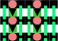
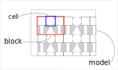

# Recurrink

Recurrink is a machine learning how to make imagery. For example:



To see more sample outputs from recurrink (we call them rinks) please check
[instagram](instagram.com/recurrink)

## Using recurrink

Recurrink is a CLI. Type `recurrink --help` to see the options.
The design is based on a hiearchy of Model > Block > Cell.



A model can generate many rinks (SVG files) according to what is defined in `conf/MODEL.yaml`. A rink is linked to a palette which can be built and viewed as `palettes/PALETTE.html`.

## Adding support for plotters

SVGs have overlapping layers. 
When overlapping colours are used together a new, third colour emerges.
This is explained in >[the color theory of Don Cooke](https://www.stumptownprinters.com/news/2016/10/26/color-by-overprinting)<

Plotters are linear. Overlapping is done by drawing lines with different pens over the same surface.

Not BFT is a new version of recurrink that implements a Cell as a Shapely Polygon. A major problem to resolve in the new version is how to transform 
existing rinks to 

1. Plot lines that can represent two-dimensional shapes - how to fill?
1. Overlap colours cleanly

### Meander 
Meander and Spiral can fill certain, angular shapes. Circles and Triangles are not included.

### Flatten
Flatten attempts to collapse a multi-layered cell onto a two-dimensional plane.
Separating the cells gives cleaner results when plotted, but there are many unresolved edge cases. 

### Solutions

#### 1. Toggle Flatten by position

Flatten is both global and dynamic. Global because ALL positions on the block are flattened whenever the output is set to a plotter. The new shapes defined by Flatten are dynamically written to SVG.

This solution converts flatten into a toggle feature. This can be useful when flatten encounters an edge case that causes the build to fail.

For example
```
  positions = {
    (0, 0): ('a', 'c', True),  # c is both cell and top
    (1, 0): ('b', 'd', True),  # d is only top
    (2, 0): ('c', None, False)
  }
```
In this example, c will overlay a in the first position. In the final position, however, c should be flattened against the lower background cell. 

#### 2. Clone and modify
In the event that colours clash when overlapped and there are build issues caused by Flatten, then rink can be cloned and the new flatten shapes used to replace the originals. These are: Gnomon, Parabola and Square Ring.

The new shapes provide a manual alternative to flatten. Dirty overlaps are removed by reducing the surface area of adjacent shapes. For example, by swapping a square for a parabola

#### 3. Flatten to YAML
YAML is a nice to have for authoring. 
Replacing the init CSV with an init YAML will be easier for the author.

This option combines both of the previous solutions. 
It involves writing the new shape definitions to a static YAML.
Then manual corrections to the YAML can override the automated definitions. It requires the codebase to support the new shapes Gnomon/Parabola/SquareRing. 

To process a flattened YAML will however, present some new problems. 
The current data model is based on three-layers.
Each shape is positioned relative to x,y with z defining the layer.
After flattening, z is irrelevant, but there are more positions on the 2-d plane.

```
+----+---+----+
| NW | N | NE |
+----+---+----+
|  W | C | E  |
+----+---+----+
| SW | S | SE |
+----+---+----+
```
Consider the following entry in the CSV file
```
shape: square, size: small, facing: all
```
This will currently produce a shape at position __C__ (c = centre).
Flattening can produce shapes for any of the nine positions in the above table.

> How to extend the YAML nomenclature to describe these new outcomes?

Perhaps the `facing` key can accept two value sets:
1. north, south, east, west that are positioned relative to bottom left
2. NW .. SE that are positioned relative to the nine shown above


### Meander
Meander is the class at the heart of recurrink for plotters.
In this version, it adopts a plug-in architecture. An overview of the plugins.

#### Guided
For shapes with corners, e.g. gnomon.

#### Spiral
For shapes that face in all directions, e.g. square

#### Composite
Combine guided algorithms and orchestrate. Used exclusively by Parabola.

In the future, two new plugins are planned: __Concentric__ for circles and __Original__ which is an up-down and avoid obstacle algorithm that was deprecated.

There are three components involved:

1. Cell.shape.guide()
1. Block.meander()
1. Block.Meander.plugin()

The Cell.shape class defines which plugin to use and some optional guides. Two examples:

```
('guided', 'EB', 'ET')           
('composite', 'SE', 'north')
```

Block.meander reads the definition and assembles the inputs required by the plugin. The plugin then generates a line (array of points) that are stored by Block. Finally, the Svg module renders as a polyline element.


### Data Model
TODO evolve the data model
1. to explain how the code is packaged
2. to extend the model to support flattening

```
cell/
cell/data.py
cell/layer.py
cell/shape/
cell/shape/rectangle.py
cell/shape/parabola.py
cell/shape/gnomon.py

block/
block/data.py
block/make.py
block/styles.py
block/spiral.py
block/meander.py
block/tmpfile.py
block/palette.py

model/
model/db.py
model/svg.py
model/data.py
model/linear.py
model/palette.py
```
Three tables in Cell
- cells c.ext int0 int1
- style [0-2]
- direction [0-2]

### Palette stabilo
The spider-web template can compare three colours.
Stabilo pen is a set of 30.
To populate all permutations 
1. randomly generate 3 colours
1. add to a set
1. if set equals 3 (no duplicates) try to add to set of sets
1. if add ok, repeat step 1
1. else stop
OR use Ruben method
>>> math.comb(30, 3)
4060

-  https://inkscape-manuals.readthedocs.io/en/latest/palette.html
-  /home/gavin/.config/inkscape/palette

Matplot SVG has limitations
- stroke is ignored, sent as edgecolour ???
- group order is ignored e.g. koto has 2 invisible squares in box view

New YAML should also remove support for small lines (use square instead)

Using kwargs send set_alpha based on fill_opacity
[](https://matplotlib.org/devdocs/api/_as_gen/matplotlib.artist.Artist.set_alpha.html#matplotlib.artist.Artist.set_alpha)


# Square Ring

Its a composite from background medium square and foreground small square.
When used without top the same colour is used for both inner and outer spirals.
But with top, the top colour becomes the inner spiral.

## Line count
3575 before not bft
2597 after refactor :-D
