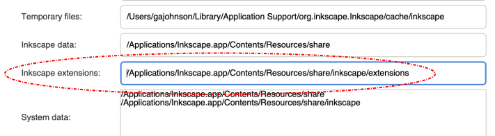
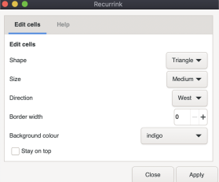
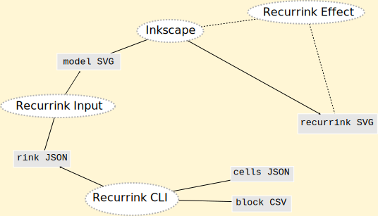

# recurrink
An inkscape extension to create recurring patterns

## Introduction to Recurrink
Blocks, Cells and Models make a recurrink.


- A model is a template made from repeating blocks
- A block is a collection of cells, marked by the red box above
- A cell is the smallest unit as shown in blue

A recurrink is the final outcome. A model styled to create a digital pattern in SVG format.


_source file [soleares.svg](./samples/soleares.svg)_


## Installation

- Open Inscape Preferences and check your extensions folder. For example on my mac it shows:



- Now you need to add the code from this repository in a New Folder called `recurrink`. The most straight forward method is to 
1. Pulldown the `Code` menu above and choose `Download ZIP` and save locally
1. Then navigate to the extensions folder and unpack the zip archive.

You should end up with a structure that looks something like this.
```
recurrink
├── README.md
├── effect.inx
├── effect.py
├── input.inx
├── input.py
├── recurrink.py
├── test.py
├── models/
├── samples/
└── tutorial/
```
Inkscape will detect the new extension after the next restart. You can check from Inkscape by selecting `Extensions > Arrange > Recurrink..`. This dialogue should pop-up.



#### Further help
- [Install Inkscape](https://inkscape.org/release/inkscape-1.1.1/) version 1.1.1 as used by this extension.
- [Read about Inkscape Extensions](https://inkscape.org/gallery/=extension/) and visit the gallery.
- [Post on the Inkscape Extension Forum](https://inkscape.org/forums/extensions/)

## Inputs, Outputs and Tools

### Inputs
The following file types are used to produce a recurrink.

#### block CSV
The positon for each cell in the block is defined in the CSV file. 
```
a b a
c d c
```
_source file [soleares.csv](models/soleares.csv)_
#### cell JSON 
Each cell also has a shape and style defined using JSON. 
```
{
  "a": {
    "shape": "square",
    "stroke_width": 1
  },
  "b": {
    "shape": "circle",
    "stroke_width": 0
  },
  "c": {
    "shape": "line",
    "stroke_width": 0
  },
  "d": {
    "shape": "triangle",
    "stroke_width": 0
  }
}
```
_source file [soleares.json](models/soleares.json)_.
#### rink JSON
The recurrink program uses a JSON configuration file named `MODEL_NAME.rink`. This file combines information from both the CSV and JSON file. It is a build file used to simplify creation of the model SVG.

#### SVG model
The model created from the RINK config lays out the design in neutral colours. Once opened, a RINK file must be manually saved using the `.svg` file extension. Once that is done, then we can get creative :art:.

### Outputs and Tools
From these inputs there are three output files that can be generated. The processing is mostly done using the following:

- _Recurrink CLI_ is used to make (or update) RINK files
- _Recurrink Input_ script converts a RINK file into a model SVG
- Inkscape and the _Recurrink Effect_ script generate the recurrink SVG, i.e. what you show your friends!

Additionally a text editor is needed to create the `block.csv` and `cells.json` files. The following diagram shows the whole life-cycle.



Now you have the background, here are some step-by-step instructions to making your first recurrink.

## Use cases and process
### UC1 Get to know recurrink by example

*If in doubt start here!*

| Input | Tool | Output |
| ---   | ---  | --- |
|SVG model | Inkscape | SVG recurrence|

1. Using Inkscape `File > Open`
1. Navigate to the Extensions folder (see Installation)
1. Open `recurrink / samples` and a select a model - you should see a grey A4 sized pattern
1. Use `Save As` and put `MyFirstRecurrink.svg` :framed_picture: in your folder of choice 
1. Now add colour using Inkscape tools such as `Fill and Stroke`.


### UC2 Update shapes in a model

| Input | Tool | Output |
| ---   | ---  | --- |
| SVG model | Inkscape + effect | SVG recurrence|

Follow the steps in UC1 but after step #5 do this

6. Using Inkscape `Extensions > Arrange > Recurrink...` - you should see a dialog window appear.
7. Select a cell for editing
8. Using the dialog, edit the cells. For example change a shape from Square to Circle.
9. Hit `Apply`

### UC3 Create a new model from existing config

| Input | Tool | Output |
| ---   | ---  | --- |
|RINK config | Inkscape + input | SVG model|

Follow the steps in UC1 but instead of step #3 do this.

3. Open `recurrink / models` and a select a RINK file - you should see a grey A4 sized pattern

### UC4 Create a RINK config from existing sources

| Input | Tool | Output |
| ---   | ---  | --- |
|CSV + JSON | recurrink\_cli | RINK config|

This use-case is mainly for when you screw-up and overwrite a RINK file as an SVG :stuck_out_tongue:
```
> ./recurrink.py -m MODEL
```
This command will re-create from CSV and JSON sources.

### UC5 Create a new configuration using CLI


| Tool | Output |
| ---  | --- |
|Text editor | CSV + JSON|

For this use-case we need to use a Text Editor and the command line. Probably easiest to start out by cloning one of the simpler models, e.g. soleares. 

1. Open your `newModel.csv` and layout the cells using `[a-z]` to position each cell.
1. Open your `newModel.json` and for each cell in the model create at least a shape definition.
1. To compile these sources run the above command and then ..

```
> ./recurrink.py -l
```
This just to check that `newModel` appears in the list :+1:

## The next three use-cases are still in development!
please be patient :blush:

### UC6 Automate new models from existing config
This is another way to do UC3 but at the command-line instead of the Inkscape UI.

| Input | Tool | Output |
| ---   | ---  | --- |
|RINK config | CLI + input | SVG model|

### UC8 Automated building of SVG recurrences
This has the same outcome as UC2 but using a CLI. Useful for testing during software development.

| Input | Tool | Output |
| ---   | ---  | --- |
|SVG model | CLI + effect | SVG recurrence|

### UC9 Choose model by using a complexity score
A complexity score is calculated using the formula `rows x cols x uniqCells`.
The scores range from 8 (2 x 2 x 2 simplest) to 3,744 (12 x 12 x 26 is the most complex done so far).

| Input | Tool | Output |
| ---   | ---  | --- |
|RINK config | recurrink\_cli | model metadata|
