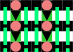
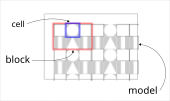

# Recurrink

Recurrink is a machine learning how to make imagery. For example:

To see more sample outputs from recurrink (we call them rinks) please check
[instagram](instagram.com/recurrink)

## Using recurrink

Recurrink is a CLI. Type `recurrink --help` to see the options.
The design is based on a hiearchy of Model > Block > Cell.

A model can generate many rinks (SVG files) according to what is defined in `conf/MODEL.yaml`. A rink is linked to a palette which can be built and viewed as `palettes/PALETTE.html`.

## Adding support for plotters

SVGs have overlapping layers. 
When overlapping colours are used together a new, third colour emerges.
This is explained in >[the color theory of Don Cooke](https://www.stumptownprinters.com/news/2016/10/26/color-by-overprinting)<

Plotters are linear. Overlapping is done by drawing lines with different pens over the same surface.

Recurrink implements geometry using [Shapely](https://github.com/shapely/shapely) to draw Polygons and lots more.

To support plotting recurrink transforms existing rinks to 

1. Two-dimensional shapes
1. Overlap colours cleanly

## Architecture

see [packages and class](doc/README.md)
