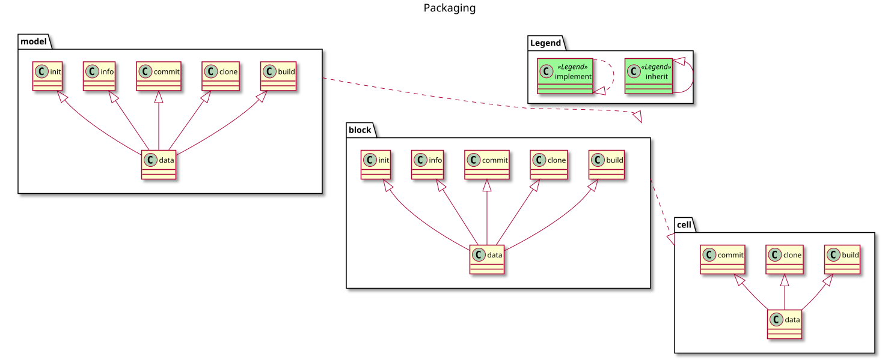
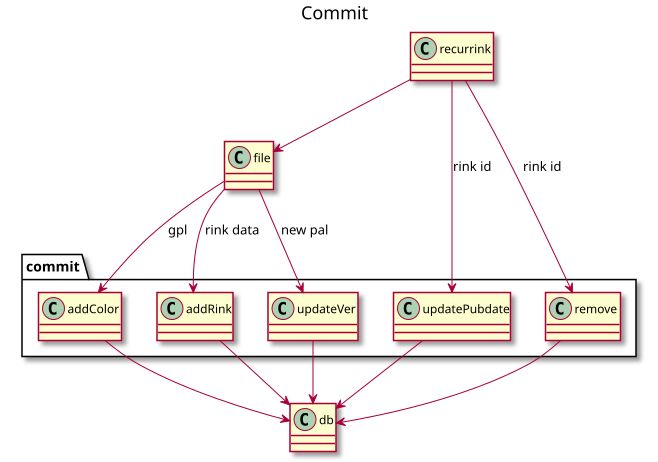
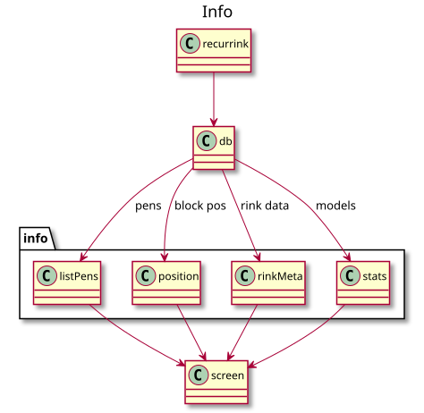
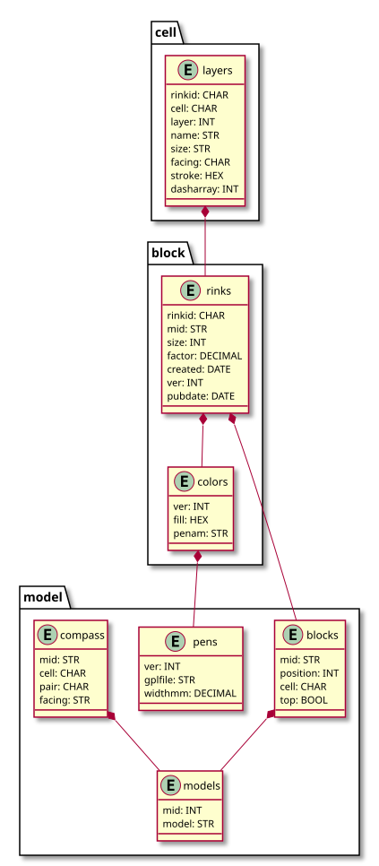

## Recurrink packages
Recurrink is designed on the MVC Pattern.

|     |     |     |
| --- | --- | --- |
|M | Model | Data Layer: Postgres, Filesystem |
|V | View  | Interface: CLI |
|C | Control | Business Process: CLI commands |

## Patterns
### Five Commands Pattern

* The business logic is held in five command classes: 
  * Build
  * Clone
  * Commit
  * Init
  * Info
* These classes exist in three packages: Model, Block and Cell
* Each class inherits data from the relevant package.
* By convention, command classes keep the same name across packages.
* Access to data from another package is done through implemention.

### Cells are Singular Pattern
Block aggregates and ensures that functions in the cell packages are called in the singular. Previously block sent all the cells in a block.  

## Class diagrams
There are five classes dedicated to business functions.

Compute a config for a new rink in YAML format.

Generate an SVG from YAML as a block or exploded to fill a given area.

Perform Create, Update and Delete operations on a Postgres database.

Read from database and copy to file for edits and further operations.

Read metadata from database and print to screen.

## Database schema

# Testing
[Unit tests](../t/README.md) are a good way to start exploring the code
