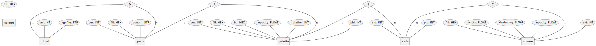

# Model

A model is a collection of blocks. The module handles outputs to SVG.

SVG generation uses Etree except for tests which use matplotlib.

### Sesanta
- 60mm is small to plot on A3
- move sesanta to model/sesanta and refactor to Block/Cell/Model
- support Linear.grid data model for custom SVG work
- experiment with SVG points: small polygons/circles or short polylines ?

### Publish and Build
+ reith broke because it uses old recurrink
- abort delete when pubdate is not null
- recurrink commit --mm should mv tmp/MODEL_mm.svg to rinks/MODEL/mm/abc123.svg

### Config_py
- move conf/minkscape.yaml to cell/ and remove from config.py
- as a new installer i want to change config.py to suit my environment
- merge db and config.py

### The Great Regression
- split tests into (a) visual (b) logical
- build a model of rinks every week. Log errors 

### Scale 
- use transform() in SVG and move scale logic to model.Layout to runs as Export
- inkscape --export-type=png --export-width=1080 --export-height=1080 
  avoid the need to manually scale? Instead set transform(0.75) in SVG doc

- update recurringart.com/ make it fit for purpose
- list --attributes to show what can be added to /tmp/MODEL.txt, colour shapes

### Models and Compass
- migrate random generation into Compass (to keep data access clean)
- Support dynamic models e.g. read positions in YAML, commit changes 
- Evolve Compass so that it can dynamically generate a model based on rules
  Symmetry, palette, divisbility, distribution (balance of intense versus space)
- grep dump and make MODEL.sql
- new model: large square + four diamonds with transparencies 
- new shape: diagonl / \ a 90 degree triangle
- add new models inspired by recurrenceModelNames.pdf
- add the spiral, envelopes and morocco models
- migrate rinks in /recurrencesArchive to postgres

### Data model
an entity diagram of the DB 1..n

