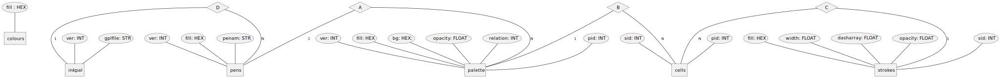
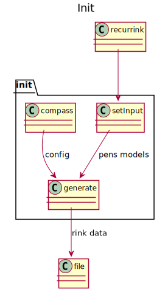
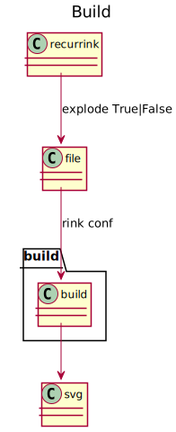
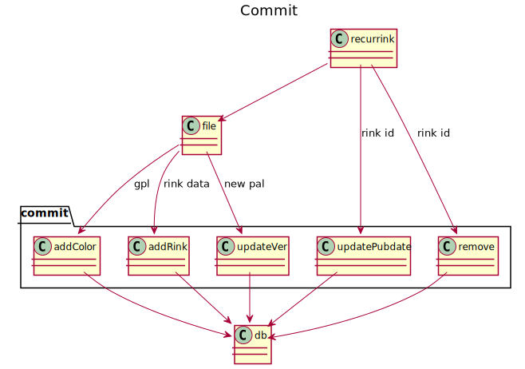
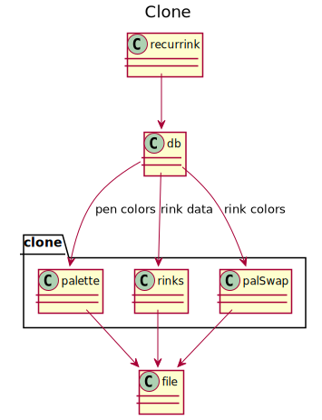
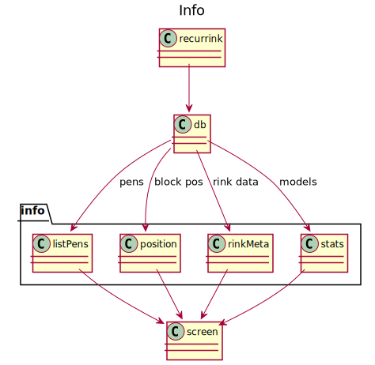

## Database schema

## Class diagrams

Compute a config for a new rink in YAML format.

Generate an SVG from YAML as a block or exploded to fill a given area.

Perform Create, Update and Delete operations on a Postgres database.

Read from database and copy to file for edits and further operations.

Read metadata from database and print to screen.
