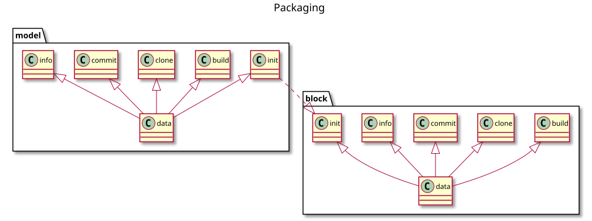
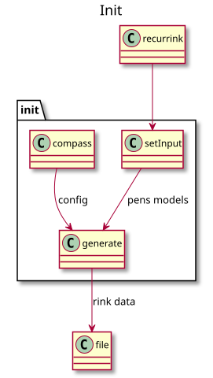
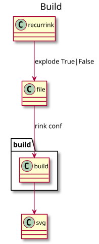
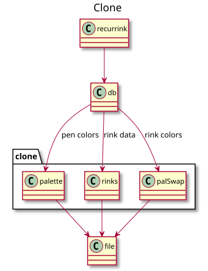
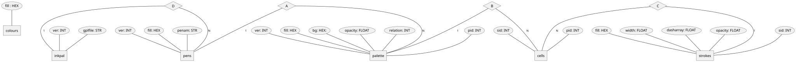

## Recurrink packages
Recurrink is designed on the MVC Pattern.

|     |     |     |
| --- | --- | --- |
|M | Model | Data Layer: Postgres, Filesystem |
|V | View  | Interface: CLI |
|C | Control | Business Process: CLI commands |


```
<|-- inherit
..|> implement
```
_all model classes implement a block class but only init is shown for brevity_

* The business logic is held in Build, Clone, Commit, Init and Info classes.
* These classes are spread across Model, Build and Clone packages.
* Each business logic class inherits data from the current package.
* Access to data from another package is done through implemention.
* By convention, business logic classes keep the same name across packages.

## Class diagrams
There are five classes dedicated to business functions.



Compute a config for a new rink in YAML format.



Generate an SVG from YAML as a block or exploded to fill a given area.


Perform Create, Update and Delete operations on a Postgres database.



Read from database and copy to file for edits and further operations.


Read metadata from database and print to screen.

## Database schema


