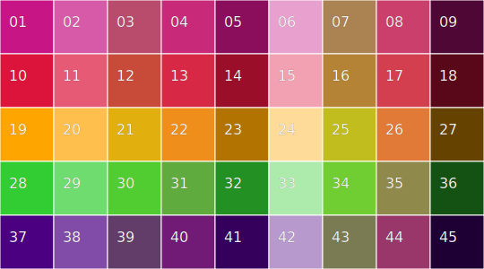
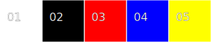

# recurrink palettes
## ver:colour45
Based on Winsor Newton ink set.
### Foreground colours
- `#DC143C` crimson
- `#C71585` mediumvioletred
- `#FFA500` orange
- `#32CD32` limegreen
- `#4B0082` indigo
### Background colours
- `#FFF` white
- `#9ACD32` yellowgreen
- `#CD5C5C` indianred
- `#000` black
### Opacity
Opacity can be set at 
* 1.0
* 0.7 
* 0.4 
* 0.0 
### Transparencies
A transparency is when a foreground colour is overlaid onto a background with enough opacity to create a new distinct colour. This gives eight possibilities for each forground.

| white | yellowgreen | indianred | black |
| ---   | ---   | ---       | ---         |
| 0.7   | 0.7   | 0.7       | 0.7         |
| 0.4   | 0.4   | 0.4       | 0.4         |

An overlay is when the foreground and background occupy the same co-ordinates. In most cases, e.g. a triangle there is both an overlay and direct exposure of the background colour. The background colour is opaque (opacity = 1.0). These four colours are not shown below.

The opposite is also a special case. When the foreground is opaque, then the background is hidden. These colours are shown in the first column below.



### Colour table
```
01 fill: #C71585 opacity: 1.0 bg: #FFF
02 fill: #C71585 opacity: 0.7 bg: #FFF
03 fill: #C71585 opacity: 0.7 bg: #9ACD32
04 fill: #C71585 opacity: 0.7 bg: #CD5C5C
05 fill: #C71585 opacity: 0.7 bg: #000
06 fill: #C71585 opacity: 0.4 bg: #FFF
07 fill: #C71585 opacity: 0.4 bg: #9ACD32
08 fill: #C71585 opacity: 0.4 bg: #CD5C5C
09 fill: #C71585 opacity: 0.4 bg: #000
10 fill: #DC143C opacity: 1.0 bg: #FFF
11 fill: #DC143C opacity: 0.7 bg: #FFF
12 fill: #DC143C opacity: 0.7 bg: #9ACD32
13 fill: #DC143C opacity: 0.7 bg: #CD5C5C
14 fill: #DC143C opacity: 0.7 bg: #000
15 fill: #DC143C opacity: 0.4 bg: #FFF
16 fill: #DC143C opacity: 0.4 bg: #9ACD32
17 fill: #DC143C opacity: 0.4 bg: #CD5C5C
18 fill: #DC143C opacity: 0.4 bg: #000
19 fill: #FFA500 opacity: 1.0 bg: #FFF
20 fill: #FFA500 opacity: 0.7 bg: #FFF
21 fill: #FFA500 opacity: 0.7 bg: #9ACD32
22 fill: #FFA500 opacity: 0.7 bg: #CD5C5C
23 fill: #FFA500 opacity: 0.7 bg: #000
24 fill: #FFA500 opacity: 0.4 bg: #FFF
25 fill: #FFA500 opacity: 0.4 bg: #9ACD32
26 fill: #FFA500 opacity: 0.4 bg: #CD5C5C
27 fill: #FFA500 opacity: 0.4 bg: #000
28 fill: #32CD32 opacity: 1.0 bg: #FFF
29 fill: #32CD32 opacity: 0.7 bg: #FFF
30 fill: #32CD32 opacity: 0.7 bg: #9ACD32
31 fill: #32CD32 opacity: 0.7 bg: #CD5C5C
32 fill: #32CD32 opacity: 0.7 bg: #000
33 fill: #32CD32 opacity: 0.4 bg: #FFF
34 fill: #32CD32 opacity: 0.4 bg: #9ACD32
35 fill: #32CD32 opacity: 0.4 bg: #CD5C5C
36 fill: #32CD32 opacity: 0.4 bg: #000
37 fill: #4B0082 opacity: 1.0 bg: #FFF
38 fill: #4B0082 opacity: 0.7 bg: #FFF
39 fill: #4B0082 opacity: 0.7 bg: #9ACD32
40 fill: #4B0082 opacity: 0.7 bg: #CD5C5C
41 fill: #4B0082 opacity: 0.7 bg: #000
42 fill: #4B0082 opacity: 0.4 bg: #FFF
43 fill: #4B0082 opacity: 0.4 bg: #9ACD32
44 fill: #4B0082 opacity: 0.4 bg: #CD5C5C
45 fill: #4B0082 opacity: 0.4 bg: #000
```
## ver:htmstarter
Hunt The Moon starter kit  
  
### Colour table
```
01 fill: #FFF opacity: 1.0 bg: #FFF
02 fill: #000 opacity: 1.0 bg: #FFF
03 fill: #F00 opacity: 1.0 bg: #FFF
04 fill: #00F opacity: 1.0 bg: #FFF
05 fill: #FF0 opacity: 1.0 bg: #FFF
```
### Implementation plan

- Emulate mirror.py by initialising models already mirrored and adding colour symmetry
- Convert palette.py into an in-memory lookup table. E.g model.reverse(fg) -> bg
- Limit the number of colour per model
- Use the 'all' cells to define the primary palette, and pair 'one' cells with complimentary colours
